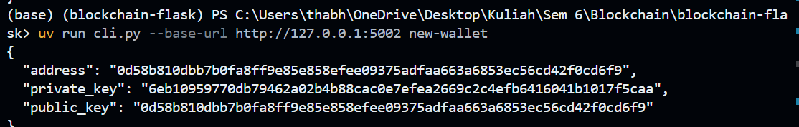
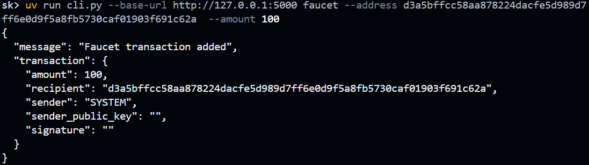
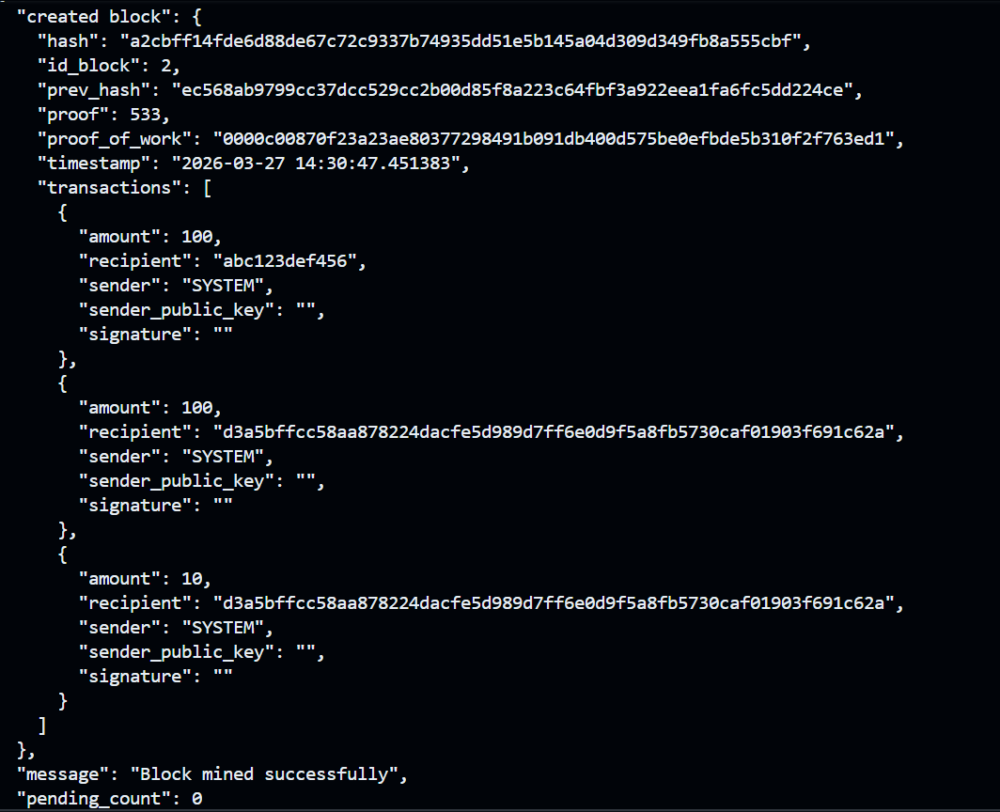
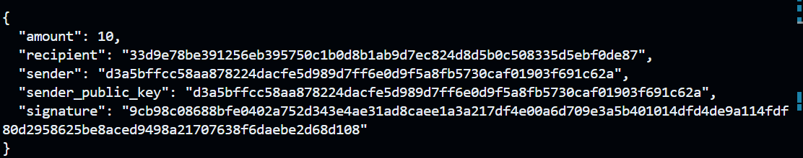

# Blockchain Flask (uv)

## Requirements

- Python 3.12+
- uv

## Quick Start

1. Install dependencies and create/update the virtual environment:

```bash
uv sync
```

2. Run one node:

```bash
PORT=5000 uv run app.py
```

3. In another terminal, check it:

```bash
uv run cli.py --base-url http://127.0.0.1:5000 get-chain
```

## How the Blockchain Works

This project keeps three in-memory data structures per node:

- `chain`: accepted blocks
- `pending_transactions`: validated transactions waiting to be mined
- `nodes`: peer node URLs used for broadcasting and conflict resolution

Block lifecycle on each node:

1. Transactions are signed client-side (with Ed25519) and sent to `/transactions/new`.
2. The node validates signature, amount, and sender balance before adding to `pending_transactions`.
3. Mining (`/mining`) finds a proof-of-work solution and creates a new block from pending transactions plus a miner reward.
4. The mined block is broadcast to peers via `/blocks/receive`.
5. Peers verify the new block linkage, proof, hash, and transaction signatures before accepting it.
6. If nodes diverge, `/nodes/resolve` replaces the local chain with the longest valid one.

## Core Blockchain Functions (`blockchain.py`)

The `Blockchain` class contains the protocol/state logic.

- `__init__()`: initializes node state and creates the genesis block.
- `create_block(proof, prev_hash, proof_of_work, transactions)`: builds a new block, computes its hash, appends it to the chain.
- `get_last_block()`: returns the chain tip.
- `proof_of_work(prev_proof)`: brute-forces a nonce until SHA-256 of `new_proof^2 - prev_proof^2` starts with `0000`.
- `get_hash(block)`: deterministic hash for block content (excluding its own `hash` field).
- `register_node(node_address)`: normalizes and stores a peer URL.
- `make_transaction_payload(sender, recipient, amount)`: canonical bytes payload used for signing/verifying transactions.
- `verify_transaction_signature(transaction)`: verifies Ed25519 signatures for non-system transactions.
- `get_balance(address)`: computes confirmed balance and subtracts pending outgoing transactions.
- `validate_transaction(transaction)`: checks fields, amount, signature validity, and sufficient sender balance.
- `add_transaction(transaction)`: validates then queues transaction to `pending_transactions`.
- `add_system_transaction(recipient, amount)`: creates system-issued transaction (for faucet/rewards).
- `broadcast_json(endpoint, payload)`: best-effort POST broadcast to all known peers.
- `is_chain_valid()`: validates full chain integrity (hash links, PoW, block hashes, signatures).
- `is_new_block_valid(block)`: validates a candidate block against current tip.
- `replace_chain(new_chain)`: accepts longer chain only if it is valid.

## API Route Functions (`routes.py`)

`register_routes(app, blockchain)` wires all HTTP handlers below:

- `get_chain()`: returns full chain and length.
- `mining()`: mines one block, appends reward transaction, broadcasts block.
- `get_pending_transactions()`: lists mempool (`pending_transactions`).
- `create_wallet()`: generates Ed25519 keypair and returns private/public keys.
- `sign_transaction()`: signs transaction payload using sender private key.
- `add_transaction()`: validates and queues a new signed transaction, then broadcasts it.
- `receive_transaction()`: accepts broadcast transactions from peers (with deduplication).
- `faucet()`: mints a system transaction into pending list and broadcasts it.
- `is_valid()`: reports chain validity.
- `get_balance(address)`: returns computed balance for one address.
- `register_nodes()`: registers peer URLs.
- `list_nodes()`: lists known peers.
- `receive_block()`: validates and appends a broadcast block; removes mined pending txs.
- `resolve_nodes()`: fetches peer chains and adopts longest valid chain.

## App Bootstrap (`app.py`)

- creates Flask app
- creates one `Blockchain` instance
- registers all routes via `register_routes(...)`
- runs on `PORT` (default `5000`)

## CLI Functions (`cli.py`)

- `call_endpoint(...)`: generic HTTP caller used by all commands.
- `build_parser()`: defines CLI commands and their arguments.
- `main()`: maps each CLI command to one API endpoint.

Main commands:

- `get-chain`, `is-valid`, `pending`, `list-nodes`, `resolve`
- `mine --miner <ADDRESS>`
- `new-wallet`
- `balance --address <ADDRESS>`
- `sign --private-key ... --sender ... --recipient ... --amount ...`
- `tx --sender ... --recipient ... --amount ... --sender-public-key ... --signature ...`
- `faucet --address ... --amount ...`
- `register-nodes --node ... --node ...`

## Run 3 Local Nodes

Start each node in a separate terminal:

```bash
# Terminal A
PORT=5000 uv run app.py

# Terminal B
PORT=5001 uv run app.py

# Terminal C
PORT=5002 uv run app.py
```

## Register Peers

Register all other nodes on each node:

```bash
uv run cli.py --base-url http://127.0.0.1:5000 register-nodes --node http://127.0.0.1:5001 --node http://127.0.0.1:5002
uv run cli.py --base-url http://127.0.0.1:5001 register-nodes --node http://127.0.0.1:5000 --node http://127.0.0.1:5002
uv run cli.py --base-url http://127.0.0.1:5002 register-nodes --node http://127.0.0.1:5000 --node http://127.0.0.1:5001
```

## End-to-End Demo Flow

### 1) Create wallets

Create wallets A, B, C and save each `private_key` and `address`:

```bash
uv run cli.py --base-url http://127.0.0.1:5000 new-wallet
uv run cli.py --base-url http://127.0.0.1:5001 new-wallet
uv run cli.py --base-url http://127.0.0.1:5002 new-wallet
```
.png%20.png)


### 2) Fund wallets with faucet

```bash
uv run cli.py --base-url http://127.0.0.1:5000 faucet --address <A_ADDRESS> --amount 100
uv run cli.py --base-url http://127.0.0.1:5001 faucet --address <B_ADDRESS> --amount 100
uv run cli.py --base-url http://127.0.0.1:5002 faucet --address <C_ADDRESS> --amount 100
```



### 3) Mine to confirm faucet transactions

```bash
uv run cli.py --base-url http://127.0.0.1:5000 mine --miner <A_ADDRESS>
```



### 4) Sign and submit transactions

Example for A -> B (10 coins):

```bash
uv run cli.py --base-url http://127.0.0.1:5000 sign --private-key <A_PRIV> --sender <A_ADDRESS> --recipient <B_ADDRESS> --amount 10
```


Copy the returned signature and submit:

```bash
uv run cli.py --base-url http://127.0.0.1:5000 tx --sender <A_ADDRESS> --recipient <B_ADDRESS> --amount 10 --sender-public-key <A_ADDRESS> --signature <SIG_FROM_SIGN>
```

Repeat the same `sign` + `tx` flow for B -> C and C -> A.

### 5) Mine and verify propagation

```bash
uv run cli.py --base-url http://127.0.0.1:5000 mine --miner <A_ADDRESS>
uv run cli.py --base-url http://127.0.0.1:5001 get-chain
uv run cli.py --base-url http://127.0.0.1:5002 get-chain
```

### 6) Resolve conflicts (if needed)

If one node misses a broadcast, run conflict resolution:

```bash
uv run cli.py --base-url http://127.0.0.1:5001 resolve
uv run cli.py --base-url http://127.0.0.1:5002 resolve
```

## Useful CLI Commands

```bash
uv run cli.py --base-url http://127.0.0.1:5000 is-valid
uv run cli.py --base-url http://127.0.0.1:5000 pending
uv run cli.py --base-url http://127.0.0.1:5000 list-nodes
uv run cli.py --base-url http://127.0.0.1:5000 balance --address <ADDRESS>
```
